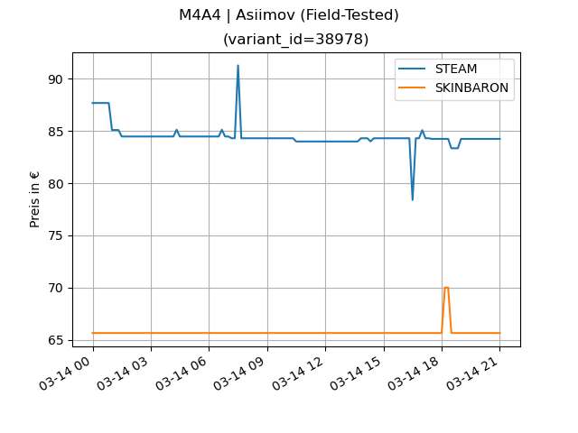

= CSGO Price Item Tracker
:numbered:
:toc:

== Installation

This Application ships as a docker image or can be used directly by cloning this repository.

=== Docker

All available versions & pull-links can be found here:
https://git.r3ktm8.de/SeaLife-Docker/csgo-price-item-tracker/container_registry[Container Registry]

You can simply run the container like this:

[source,bash]
----
docker pull ...
docker run --rm -it -v $PWD/sv.db:/usr/src/app/sv.db <image> python main.py
----

You could easily add a new weapon to track like this:

[source,bash]
----
docker pull ...
docker run --rm -it -v $PWD/sv.db:/usr/src/app/sv.db <image> python main.py --create
----

After issuing this, you need to follow the instructions.

=== Cloning

You can simply clone this repository and install all requirements by running

[source,bash]
----
python -m pip install --no-cache-dir -r requirements.txt
----

After this you can simply run the `main.py` with the required arguments.

== Usage

=== Help

[source,bash]
----
Usage main.py -svpdlchr
 options:
  -h, --help             displays this help information
  -v                     increases the log level by 10
  -s                     decreases the log level by 10
  -p, --process          runs the processor to fetch prices from Steam and SkinBaron
  -c, --create           interactive creation of a weapon
  -l, --list             lists all items
  -r, --remove [id]      removes the weapon by id
  -d, --generate-charts  generates the charts and sends them per mail
----

=== Creating a Weapon to track

To create a new Weapon, you need to call the `main.py` with the `-c|--create` argument and follow the instructions.

The `Weapon Name` is the name in the market e.g.: `AWP | The Prince (Field-Tested)` or `M4A4 | Asiimov (Field-Tested)`.

The `Variant ID` is a bit more complicated.
You need to go to https://skinbaron.de and lookup the requested weapon by typing its name and clicking on it.
After this you can see the `variantId` in the url (like this for the AWP Asiimov `https://skinbaron.de/?appId=730&variantId=38906&sort=BP` => `38906`).

The other values are related to skin baron as well and are used to only select a certain type of weared weapons.

You can check the creation of the items by calling the `main.py` with `-l|--list`.

TIP: You can chain the create and list argument for verification simply by calling `python3 main.py -cl`.

=== Processing the data

To resolve the prices for your weapons simply call the `main.py` with `-p|--process`.

=== Generating the charts and send the mail

To generate the charts simply call the `main.py` with `-d|--generate-charts`.

[WARNING]
You need some environment variables set to use this feature (to send the mail)

.Environment Variables
[source]
----
export MAIL_SMTP_HOST=smtp.example.com
export MAIL_SMTP_PORT=587
export MAIL_SMTP_TLS=1
export MAIL_SMTP_USER=csgo-tracker@example.com
export MAIL_SMTP_PASSWORD=csgotrackeruser
export MAIL_RECEIVER=my_receiver_mail@yahoo.com
----

.Example Chart
